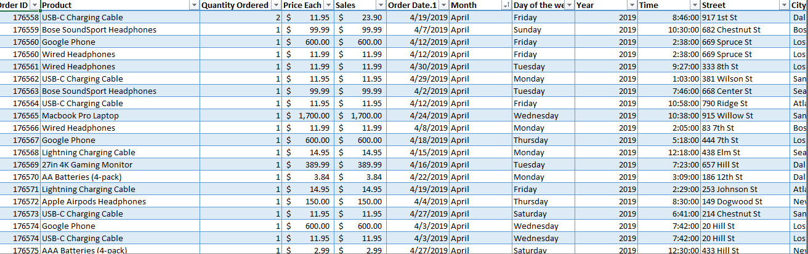

## Sales Analysis

# Introduction
This analysis seeks to derive insights from the sales data in order to evaluate sales performance. The specific objectives are as follows:
Determine the month with the highest sales revenue.

Identify the city with the highest number of sales transactions.

Determine the optimal time for displaying advertisements to increase the probability of purchase.

Identify the product that achieved the highest sales volume.

# About the data
The dataset consists of sales data from 43 cities in the United States during the year 2019. It includes information such as the
Order ID,
products sold,
quantity ordered,
price per unit ,
date and time of each order,
as well as the address associated with each transaction

# Methodology
The analysis was conducted utilizing Microsoft Excel as the primary tool. The initial step involved cleaning and merging the raw datasets using Power Query, a feature within Excel. 
Pivot tables were then employed to perform calculations and generate summarized data. To present the findings, charts were utilized to visualize the insights derived from the analysis. 
Finally, Microsoft PowerPoint was used for report writing, enabling the creation of a comprehensive and visually appealing presentation of the analysis results.

# Data Visualization

Based on the analysis conducted, it is evident that San Francisco had the highest purchase amount and the highest number of products sold during the month of December. The optimal time for displaying advertisements was determined to be 9:00, as this timeframe exhibited a higher likelihood of generating more purchases. The most sold product was identified as the AA-Batteries (4-pack).
These insights derived from the analysis can be leveraged to maximize sales and aid in decision-making processes. By capitalizing on the high purchasing trends in San Francisco and focusing advertising efforts during the recommended time slot, businesses can increase the probability of attracting more customers and boosting sales. Additionally, understanding the top-selling product allows for strategic inventory management and potential opportunities for cross-selling or upselling. Overall, these findings provide valuable guidance for optimizing sales strategies and improving business performance.

